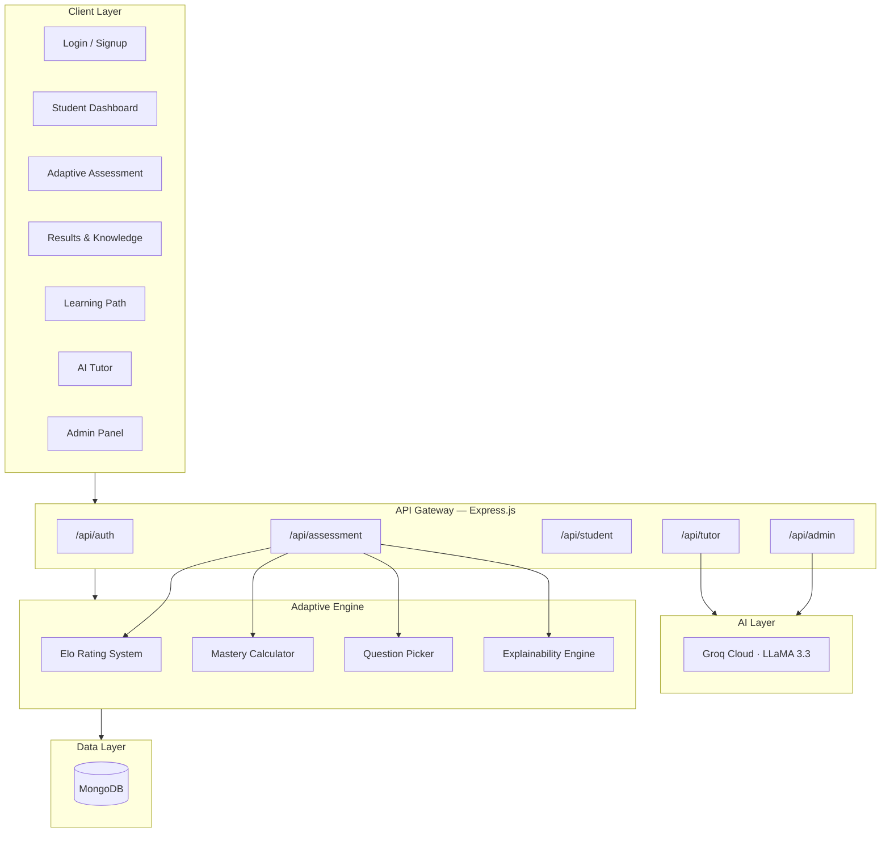
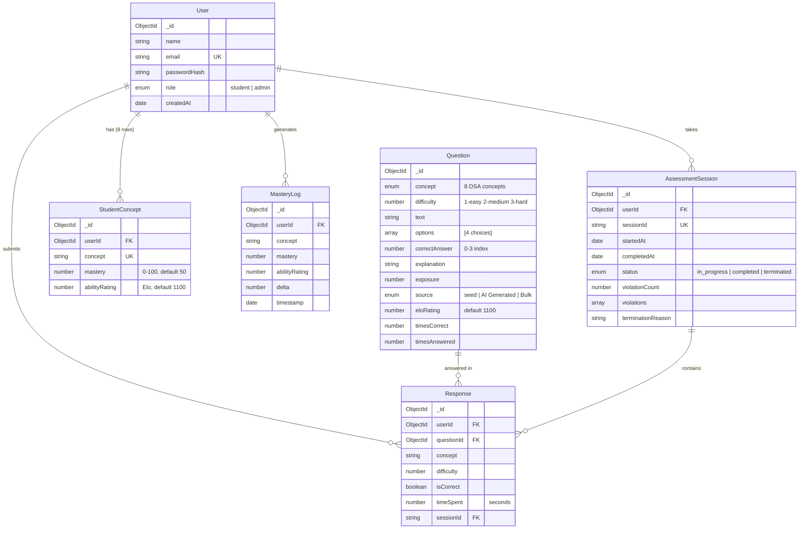

# PARAKH AI

<p align="center">
  
  
  
</p>

<p align="center">
  <b>AI-Powered Adaptive Assessment & Learning Platform for Data Structures & Algorithms</b><br/>
  <sub>Built in 24 hours — real mastery tracking, real AI, real proctoring</sub>
</p>

---

## Table of Contents

- [Architecture Overview](#architecture-overview)
- [System Architecture](#system-architecture)
- [Data Model](#data-model)
- [Adaptive Assessment Engine](#adaptive-assessment-engine)
- [Feature Set](#feature-set)
- [Tech Stack](#tech-stack)
- [API Reference](#api-reference)
- [Project Structure](#project-structure)
- [Quick Start](#quick-start)
- [Screenshots](#screenshots)
- [Team](#team)

---

## Architecture Overview

```
                          ┌──────────────────────────────┐
                          │        BROWSER (Vite)         │
                          │   React 19 · Tailwind CSS 4   │
                          │     Outfit · Scaler Blue      │
                          └──────────────┬───────────────┘
                                         │  REST / JSON
                                         │  JWT Bearer Token
                          ┌──────────────▼───────────────┐
                          │       EXPRESS API :5000       │
                          │    cors · bcrypt · jsonwebtoken│
                          └──────┬───────────────┬───────┘
                                 │               │
                    ┌────────────▼───┐   ┌───────▼────────┐
                    │   MongoDB 7.x  │   │   Groq Cloud   │
                    │   Mongoose 8.x │   │   LLaMA 3.3    │
                    └────────────────┘   └────────────────┘
```

## System Architecture



## Data Model



## Adaptive Assessment Engine

PARAKH AI's assessment engine selects questions dynamically based on the student's demonstrated ability, not a pre-determined path.

### Elo Rating System

| Parameter | Value | Purpose |
|-----------|-------|---------|
| `K_STUDENT` | 24 | How much a student's rating moves per answer |
| `K_QUESTION` | 8 | How much a question's rating moves per answer |
| Base rating | 1100 | Starting Elo for both students and questions |
| Expected score | `1 / (1 + 10^((Q − S) / 400))` | Probability of correct answer |

### Difficulty Adaptation Algorithm

```
┌─────────────────────────────────────────────────────────┐
│                  QUESTION SELECTION FLOW                 │
├─────────────────────────────────────────────────────────┤
│  1. Pick WEAKEST concept (lowest mastery < 70)          │
│     └─ Fallback: random concept if all ≥ 70             │
│                                                         │
│  2. Set target difficulty from mastery:                 │
│     mastery < 40%  →  difficulty 1 (Easy)               │
│     mastery < 70%  →  difficulty 2 (Medium)             │
│     mastery ≥ 70%  →  difficulty 3 (Hard)               │
│                                                         │
│  3. DIFFICULTY BOOST: consecutive correct ≥ 2           │
│     └─ Increase target difficulty by 1 (max 3)          │
│                                                         │
│  4. Query question bank:                                │
│     └─ Match concept + difficulty                       │
│     └─ EXCLUDE all previously answered (lifetime)       │
│     └─ Sort by closest Elo match                        │
│     └─ Take nearest, fallback to random if no Elo match │
│                                                         │
│  5. After answer: update Elo ratings, mastery %,        │
│     log MasteryLog, record Response                     │
└─────────────────────────────────────────────────────────┘
```

### Mastery Calculation

After each answer, the student's mastery for the current concept is recalculated:

```
mastery_delta = isCorrect
  ? +(10 * difficulty * bonus)
  : -(8 * difficulty * penalty)

bonus    = 1.0 + (consecutive streak * 0.15)
penalty  = 1.0 + ((1.0 / mastery) * 5)     ← stronger penalty at low mastery

new_mastery = clamp(mastery + mastery_delta, 0, 100)
```

### Why This Question? — Explainability

Every question comes with a plain-language reason string visible to the student, explaining exactly why the engine chose this question:

- **Reinforcement**: "After recent miss on BST" — revisits a concept the student got wrong
- **Advancing**: "Advancing difficulty after 2 consecutive correct" — confidence is increasing
- **Weak area**: "Building foundational understanding" — mastery below 40%, starting easy
- **Developing**: "Medium difficulty challenge" — mastery between 40-69%
- **Strong area**: "High difficulty mastery problem" — mastery at 70%+, pushing limits

---

## Feature Set

### 1. Authentication & Authorization
- Email/password signup with JWT (7-day expiry)
- bcrypt password hashing (salt rounds: 10)
- Role-based access: `student` and `admin`
- Automatic StudentConcept seeding on signup (8 DSA concepts with realistic defaults)

### 2. Student Dashboard
- Real-time mastery snapshot across all 8 DSA concepts
- Color-coded classification: Strong (>=70%), Developing (40-69%), Weak (<40%)
- Flagged weak areas with direct link to assessment
- Quick-action cards for assessment, learning path, and AI tutor

### 3. Adaptive Assessment
- Dynamic 7-question session with real-time difficulty adaptation
- Lifetime no-repeat guarantee — students never see the same question twice
- Fullscreen enforcement with proctoring (3 violation limit)
- Violation types: tab switch, fullscreen exit, window blur
- 4 violations trigger session termination (no mastery changes saved)
- "Why this question?" explainability panel for every question

### 4. Results & Knowledge Profile
- Post-assessment summary with overall mastery display
- Concept breakdown: Strong / Developing / Needs Attention buckets
- Personalized insight sentence generated from real data
- Direct CTAs to knowledge profile and retake assessment

### 5. Detailed Knowledge Analytics
- Accordion per concept with expandable metrics
- Sparkline trend visualization (last 10 mastery records)
- Accuracy, attempt count, and average response time per concept
- Recent form history (last 5 — correct/incorrect)
- AI-driven insight text per concept

### 6. Personalized Learning Roadmap
- 10-module progressive learning path with prerequisites
- Square node milestones: Completed / Up Next / Locked states
- Mastery threshold per module (70% or 80%)
- Modal detail view with estimated question count per module
- Overall roadmap progress percentage

### 7. AI Tutor
- Context-aware chat powered by Groq LLaMA 3.3
- Backend assembles real student mastery data as context
- Automatic concept detection from message keywords
- Suggested prompt chips for common queries
- Personalized responses grounded in the student's actual performance

### 8. Admin Dashboard
- Institution-wide knowledge gap aggregation (MongoDB pipeline)
- Real-time average mastery per concept across all students
- Count of students below 40% mastery per concept
- AI Question Generator: generate new MCQs via Groq
- Auto-persistence to question bank with duplicate detection
- Validation checklist per generated question

---

## Tech Stack

| Layer | Technology | Purpose |
|-------|-----------|---------|
| **Runtime** | Node.js 18+ | Server-side JavaScript |
| **Backend** | Express 4.19 | REST API framework |
| **Database** | MongoDB 7.x + Mongoose 8.x | Document store with rich querying |
| **Auth** | JWT · bcryptjs 2.4 | Token-based auth with password hashing |
| **AI / LLM** | Groq SDK 1.5 + LLaMA 3.3 | Question generation, AI tutor responses |
| **CORS** | cors 2.8 | Cross-origin request handling |
| **Dev** | nodemon 3.1 | Auto-restart on file changes |
| | | |
| **Frontend** | React 19.2 | UI library (functional components + hooks) |
| **Build** | Vite 8.2 | Fast HMR, optimized builds |
| **CSS** | Tailwind CSS 4.3 | Utility-first CSS framework |
| **Routing** | React Router 7.18 | Client-side navigation |
| **Font** | Outfit (Google Fonts) | Geometric sans-serif, Clash Grotesk alternative |
| **Lint** | oxlint 1.75 | Fast Rust-based JavaScript linter |
| **Design** | Scaler Academy inspired | Flat, square, blue-brand, dual-mode (light + dark) |

---

## API Reference

### Authentication

| Method | Endpoint | Auth | Description |
|--------|----------|------|-------------|
| `POST` | `/api/auth/signup` | — | Create account + seed 8 concept rows |
| `POST` | `/api/auth/login` | — | Authenticate, return JWT + user |
| `GET` | `/api/auth/me` | Bearer | Get current user profile |

**POST /api/auth/signup**
```json
{ "name": "Aksh Sharma", "email": "aksh@example.com", "password": "secure123" }
```
**Response (201)**:
```json
{
  "token": "eyJhbGciOi...",
  "user": { "id": "...", "name": "Aksh Sharma", "email": "aksh@...", "role": "student" }
}
```

### Assessment

| Method | Endpoint | Auth | Description |
|--------|----------|------|-------------|
| `POST` | `/api/assessment/start` | Bearer | Create assessment session |
| `GET` | `/api/assessment/next?sessionId=` | Bearer | Get next adaptive question |
| `POST` | `/api/assessment/answer` | Bearer | Submit answer, get mastery update |
| `POST` | `/api/assessment/violation` | Bearer | Report proctoring violation |

**POST /api/assessment/answer**
```json
{
  "questionId": "64f...",
  "selectedAnswer": 1,
  "timeSpent": 28,
  "sessionId": "uuid-..."
}
```
**Response (200)**:
```json
{
  "isCorrect": true,
  "correctAnswer": 1,
  "explanation": "In-order traversal produces...",
  "masteryDelta": 12,
  "updatedMastery": 55,
  "questionsAnswered": 3,
  "done": false
}
```

### Student

| Method | Endpoint | Auth | Description |
|--------|----------|------|-------------|
| `GET` | `/api/student/state` | Bearer | Full mastery profile + analytics |

**Response (200)**:
```json
{
  "concepts": [
    {
      "concept": "BST",
      "mastery": 43,
      "history": [{ "mastery": 38, "delta": 5 }, ...],
      "accuracy": 62,
      "attemptCount": 12,
      "averageResponseTime": 24,
      "recentAttempts": [true, false, true, true, false],
      "trend": "improving"
    }
  ],
  "overallMastery": 56,
  "strong": [...], "developing": [...], "weak": [...]
}
```

### AI Tutor

| Method | Endpoint | Auth | Description |
|--------|----------|------|-------------|
| `POST` | `/api/tutor/ask` | Bearer | Get AI tutor response |

**Request**: `{ "message": "Why am I struggling with BST deletion?" }`
**Response**: Personalized LLM response grounded in student's actual mastery data.

### Admin

| Method | Endpoint | Auth + Role | Description |
|--------|----------|-------------|-------------|
| `GET` | `/api/admin/gaps` | Bearer + admin | Aggregated concept mastery across all students |
| `POST` | `/api/admin/generate-question` | Bearer + admin | AI-generate + persist new MCQ |

---

## Project Structure

```
PARAKH-AI/
├── frontend/                          # React 19 + Vite + Tailwind 4
│   ├── index.html                     # Entry HTML with Outfit font
│   ├── vite.config.js                 # Vite config + Tailwind plugin
│   ├── tailwind.config.js             # Tailwind config
│   └── src/
│       ├── main.jsx                   # React entry point
│       ├── App.jsx                    # Router + providers
│       ├── index.css                  # Design system (Scaler theme)
│       ├── context/
│       │   ├── AuthContext.jsx        # Auth state + JWT management
│       │   └── ThemeContext.jsx       # Light/dark mode toggle
│       ├── components/
│       │   ├── Layout.jsx             # App shell + navigation
│       │   └── ProtectedRoute.jsx     # Auth guard
│       └── pages/
│           ├── Login.jsx              # Sign-in page
│           ├── Signup.jsx             # Registration page
│           ├── Dashboard.jsx          # Student landing
│           ├── Assessment.jsx         # Quiz engine + proctoring
│           ├── Results.jsx            # Post-assessment summary
│           ├── Knowledge.jsx          # Detailed concept analytics
│           ├── LearningPath.jsx       # 10-module roadmap
│           ├── AiTutor.jsx            # LLM chat interface
│           └── Admin.jsx              # Gap view + question generator
│
├── backend/                           # Express 4 + Mongoose 8
│   ├── .env                           # Environment variables
│   ├── .env.example                   # Environment template
│   └── src/
│       ├── index.js                   # Express server entry
│       ├── config/
│       │   └── db.js                  # MongoDB connection
│       ├── middleware/
│       │   └── auth.js                # JWT verification
│       ├── models/
│       │   ├── User.js                # Student + admin accounts
│       │   ├── Question.js            # MCQ bank (8 concepts × 3 difficulties)
│       │   ├── StudentConcept.js      # Per-student concept mastery
│       │   ├── Response.js            # Answer history
│       │   ├── AssessmentSession.js   # Session + proctoring
│       │   └── MasteryLog.js          # Mastery change audit trail
│       ├── routes/
│       │   ├── auth.js                # Signup / login / me
│       │   ├── assessment.js          # Adaptive engine (413 LOC)
│       │   ├── student.js             # State API + analytics
│       │   ├── tutor.js               # AI tutor endpoint
│       │   └── admin.js               # Gaps + question generator
│       └── scripts/
│           ├── seedQuestions.js       # Seed BST/AVL question bank
│           ├── seedAdminAndStudents.js  # Seed admin + demo students
│           ├── bulkGenerateQuestions.js # Batch AI question generation
│           └── warmupLLM.js           # LLM cold-start warmup
│
├── docs/
│   ├── README.md                      # Local setup guide
│   ├── prompt.md                      # Hackathon build spec
│   ├── prompt2.md                     # Extended spec
│   └── scaler-com-design.md           # Design system reference
│
├── package.json                       # Root scripts (concurrently)
├── FRONTEND_REFACTOR_PLAN.md          # Design refactor plan
└── README.md                          # This file
```

---

## Quick Start

### Prerequisites
- Node.js 18+
- MongoDB 7.x (local or Atlas)
- [Groq API Key](https://console.groq.com/keys)

### 1. Clone & Install

```bash
git clone https://github.com/your-org/parakh-ai.git
cd parakh-ai
npm run install:all
```

### 2. Configure Environment

```bash
# Backend
cp backend/.env.example backend/.env
```

Edit `backend/.env`:
```env
MONGO_URI=mongodb://localhost:27017/parakh-ai
JWT_SECRET=your-secret-key-here
LLM_API_KEY=gsk_your_groq_api_key_here
PORT=5000
FRONTEND_URL=http://localhost:5173
```

### 3. Seed Database

```bash
npm run seed:questions   # Populate question bank (BST/AVL)
npm run seed:admin        # Create admin + demo student accounts
```

### 4. Run

```bash
npm run dev
```

| Service | URL |
|---------|-----|
| Frontend | http://localhost:5173 |
| Backend API | http://localhost:5000 |
| Health Check | http://localhost:5000/api/health |

### Demo Credentials

| Role | Email | Password |
|------|-------|----------|
| Admin | `admin@parakh.ai` | `admin123` |
| Student | `student@example.com` | `student123` |

---

## Screenshots

*Coming soon — screenshots of the dashboard, assessment flow, knowledge profile, learning path, AI tutor, and admin panel will be added here.*

---

## Design System

PARAKH AI follows a **Scaler Academy-inspired** design language:

| Property | Value |
|----------|-------|
| **Primary** | `#004CE5` (Scaler Blue) |
| **Accent** | `#011A53` (Deep Link Blue) |
| **Secondary** | `#E6F0FF` (Pale Blue fill) |
| **Background** | `#FFFFFF` (Light) / `#070B15` (Dark) |
| **Card** | `#FFFFFF` / `#0F1525` (Dark) |
| **Font** | Outfit (400–800) |
| **Border Radius** | 0px (flat, square) |
| **Shadows** | None |
| **Gradients** | None |
| **Modes** | Light + Dark |

---

<p align="center">
  <sub>Built with precision. Driven by data. Powered by AI.</sub>
</p>
