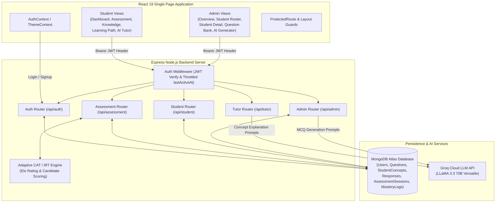
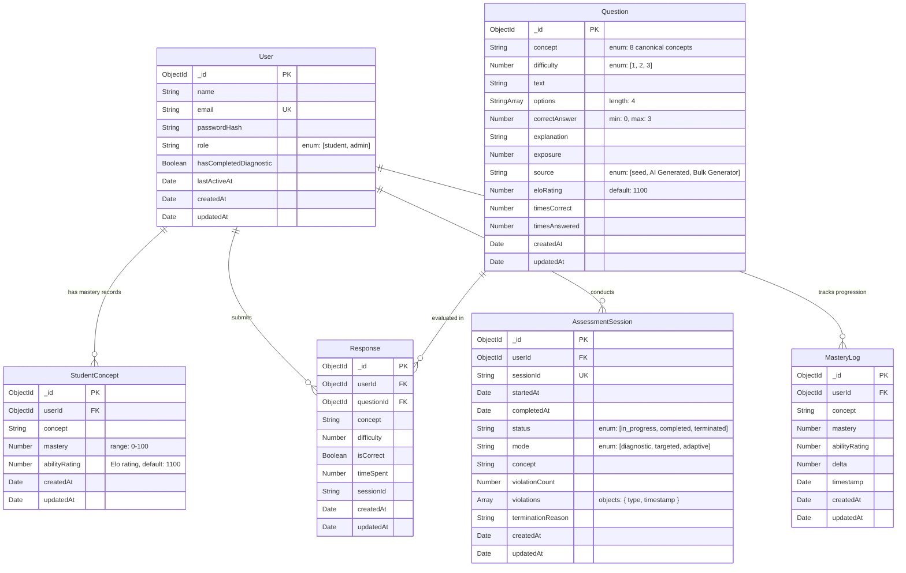
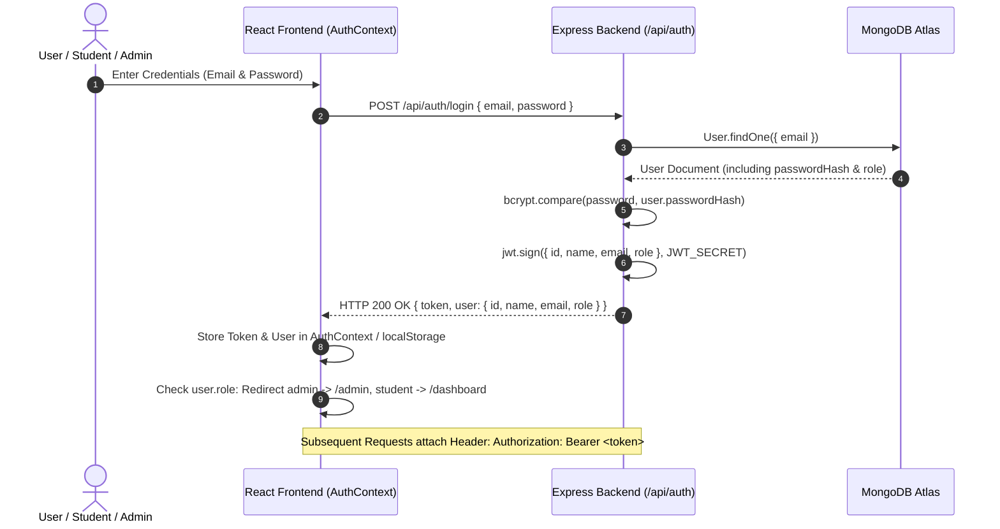
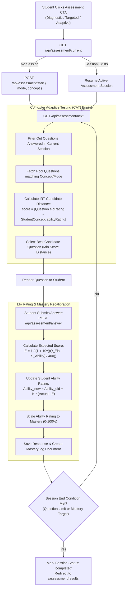
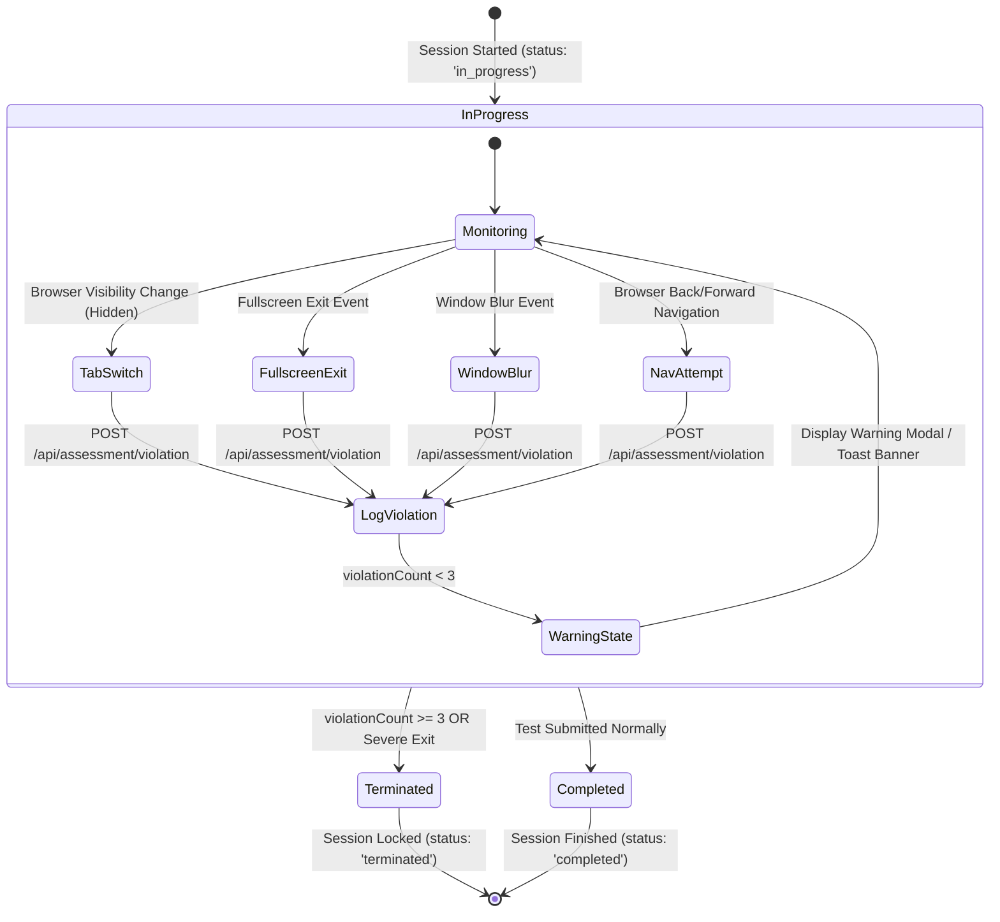
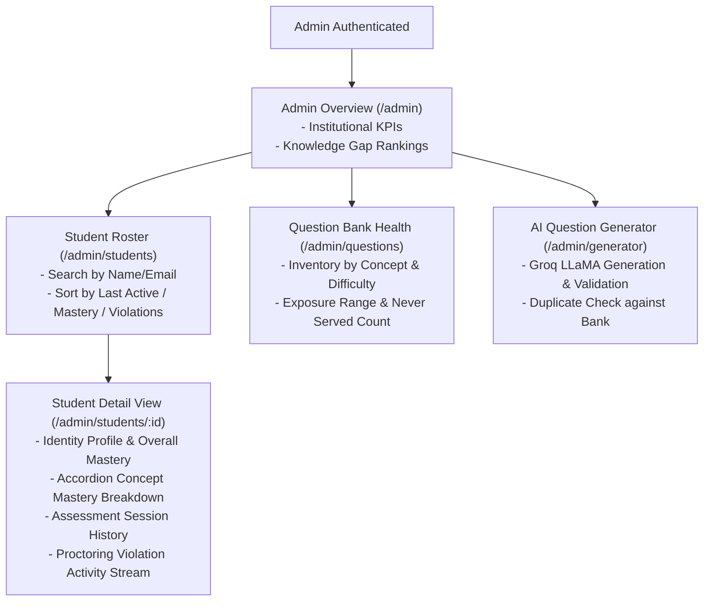

# PARAKH AI — Adaptive Assessment & Institutional Intelligence Platform

PARAKH AI is a full-stack, AI-powered adaptive assessment system engineered for higher education and competitive learning. It replaces static examinations with Computer Adaptive Testing (CAT) based on Item Response Theory (IRT) and Elo rating algorithms. The platform dynamically recalibrates question difficulty based on real-time student performance, enforces integrity via automated client-side proctoring violation tracking, provides instant AI-powered concept tutoring (powered by Groq LLaMA-3.3-70B), and surfaces real-time institutional knowledge gap analytics and student oversight for educators.

---

## Tech Stack

### Backend
- **Runtime & Framework:** Node.js, Express (`^4.19.2`)
- **Database & ODM:** MongoDB, Mongoose (`^8.4.4`)
- **Authentication & Security:** JSON Web Tokens (`jsonwebtoken` `^9.0.2`), Password Hashing (`bcryptjs` `^2.4.3`), CORS (`^2.8.5`)
- **AI / LLM Integration:** Groq SDK (`groq-sdk` `^1.5.0`, model `llama-3.3-70b-versatile`)
- **Environment Management:** `dotenv` (`^16.4.5`)

### Frontend
- **Framework & Build Tool:** React 19 (`react` `^19.2.8`), Vite (`^8.2.0`)
- **Routing & State:** React Router DOM (`^7.18.2`), React Context API (`AuthContext`, `ThemeContext`)
- **Styling & UI:** Tailwind CSS (`^4.3.3`), `@tailwindcss/vite` (`^4.3.3`), PostCSS, Lucide React (`^1.31.0`), Framer Motion (`^13.1.0`), `clsx`, `tailwind-merge`
- **Data Visualization:** Recharts (`^3.10.1`)
- **Linter:** Oxlint (`^1.75.0`)

---

## System Architecture



---

## Data Model & Entity Relationship Diagram



---

## Repository Structure

```
SIH2026_INTERNAL/
├── backend/                       # Express Node.js Backend API Service
│   ├── src/
│   │   ├── config/
│   │   │   └── db.js              # MongoDB Atlas connection setup & auto-seeder
│   │   ├── middleware/
│   │   │   └── auth.js            # JWT verification & throttled lastActiveAt middleware
│   │   ├── models/                # Mongoose database schemas
│   │   │   ├── AssessmentSession.js
│   │   │   ├── MasteryLog.js
│   │   │   ├── Question.js
│   │   │   ├── Response.js
│   │   │   ├── StudentConcept.js
│   │   │   └── User.js
│   │   ├── routes/                # Express API router controllers
│   │   │   ├── admin.js
│   │   │   ├── assessment.js
│   │   │   ├── auth.js
│   │   │   ├── student.js
│   │   │   └── tutor.js
│   │   ├── scripts/               # Maintenance, migration, and verification scripts
│   │   │   ├── bulkGenerateQuestions.js
│   │   │   ├── cleanupTestAccounts.js
│   │   │   ├── countQuestions.js
│   │   │   ├── migrateAbilityRatings.js
│   │   │   ├── migrateDiagnosticFlag.js
│   │   │   ├── migrateQuestionElo.js
│   │   │   ├── rehearseDemo.js
│   │   │   ├── seedAdminAndStudents.js
│   │   │   ├── seedAllDemoData.js
│   │   │   ├── seedQuestions.js
│   │   │   ├── verifyPhase12And13.js
│   │   │   ├── verifyPhase14.js
│   │   │   ├── verifyPhase15.js
│   │   │   └── warmupLLM.js
│   │   └── index.js               # Express application entry point & CORS configuration
│   ├── .env.example               # Template environment configuration file
│   └── package.json               # Backend dependencies & script definitions
├── frontend/                      # React 19 + Vite Frontend SPA Service
│   ├── public/                    # Static brand assets (favicon.svg, logo.svg)
│   ├── src/
│   │   ├── components/            # Reusable UI components & layouts
│   │   │   ├── Layout.jsx         # Dynamic role-separated navigation shell
│   │   │   └── ProtectedRoute.jsx # Role-aware route guard & active assessment lock
│   │   ├── context/               # Global state contexts
│   │   │   ├── AuthContext.jsx    # User authentication & token state provider
│   │   │   └── ThemeContext.jsx   # Dark/light theme state provider
│   │   ├── pages/                 # Route page components
│   │   │   ├── Admin.jsx          # Institutional Overview KPI Dashboard
│   │   │   ├── AiGenerator.jsx    # AI Question Generator & Groq LLaMA validator
│   │   │   ├── AiTutor.jsx        # Conversational AI Tutor interface
│   │   │   ├── Assessment.jsx     # Active CAT assessment player & proctoring listener
│   │   │   ├── Dashboard.jsx      # Student dashboard & readiness metrics
│   │   │   ├── Knowledge.jsx      # Interactive student Knowledge Profile & concept breakdown
│   │   │   ├── Landing.jsx        # Product landing page
│   │   │   ├── LearningPath.jsx   # Targeted study plan & adaptive recommendations
│   │   │   ├── Login.jsx          # Auth login page
│   │   │   ├── QuestionBankHealth.jsx # Admin Question Bank inventory & health matrix
│   │   │   ├── Results.jsx        # Test completion summary & score report
│   │   │   ├── Signup.jsx         # Auth signup page
│   │   │   ├── StudentDetail.jsx  # Admin student drill-down view & violation stream
│   │   │   └── StudentRoster.jsx  # Admin student roster table with search/sort
│   │   ├── App.jsx                # Application routes & layout bindings
│   │   ├── index.css              # Custom styling system, design tokens, & keyframes
│   │   └── main.jsx               # React DOM entry point
│   ├── package.json               # Frontend dependencies & build script definitions
│   └── vite.config.js             # Vite bundler configuration
├── render.yaml                    # Render Infrastructure-as-Code Blueprint specification
└── README.md                      # Comprehensive system documentation
```

---

## Core Workflows

### 1. Authentication Flow



---

### 2. Student Assessment & CAT Adaptive Loop



---

### 3. Proctoring & Violation State Machine



---

### 4. Admin Workflow



---

## API Reference

### Auth Endpoints (`/api/auth`)
| Method | Endpoint | Auth Required | Description |
| :--- | :--- | :--- | :--- |
| `POST` | `/api/auth/signup` | Public | Registers a new student account and seeds initial concept records. |
| `POST` | `/api/auth/login` | Public | Authenticates user credentials and returns a JWT token. |
| `GET` | `/api/auth/me` | Protected | Returns current authenticated user profile payload. |
| `POST` | `/api/auth/seed-demo` | Public | Utility endpoint to seed standard admin and student demo accounts. |

### Assessment Endpoints (`/api/assessment`)
| Method | Endpoint | Auth Required | Description |
| :--- | :--- | :--- | :--- |
| `GET` | `/api/assessment/current` | Protected | Checks if user has an active, in-progress assessment session. |
| `POST` | `/api/assessment/start` | Protected | Initializes a new assessment session (`diagnostic`, `targeted`, `adaptive`). |
| `POST` | `/api/assessment/violation` | Protected | Logs a proctoring violation event and checks termination thresholds. |
| `POST` | `/api/assessment/quit` | Protected | Allows student to manually terminate their active test session. |
| `GET` | `/api/assessment/next` | Protected | Retrieves the next adaptive candidate question using CAT/IRT logic. |
| `POST` | `/api/assessment/answer` | Protected | Evaluates question response, updates Elo ratings & mastery, and logs response. |

### Student Endpoints (`/api/student`)
| Method | Endpoint | Auth Required | Description |
| :--- | :--- | :--- | :--- |
| `GET` | `/api/student/state` | Protected | Returns user's concept mastery values, accuracy, response time, and trend history. |

### AI Tutor Endpoints (`/api/tutor`)
| Method | Endpoint | Auth Required | Description |
| :--- | :--- | :--- | :--- |
| `POST` | `/api/tutor/ask` | Protected | Submits concept query to Groq LLaMA-3.3-70B with context-aware student data. |

### Admin Endpoints (`/api/admin`)
| Method | Endpoint | Auth Required | Description |
| :--- | :--- | :--- | :--- |
| `GET` | `/api/admin/overview` | Admin Only | Returns institutional KPI metrics (students, assessments, mastery, bank size, violations). |
| `GET` | `/api/admin/gaps` | Admin Only | Aggregates knowledge gap rankings sorted weakest concept first. |
| `GET` | `/api/admin/students` | Admin Only | Returns searchable, sortable list of students with proctoring violation flags. |
| `GET` | `/api/admin/students/:id` | Admin Only | Returns detailed profile, concept breakdown, test history, and violation log for a student. |
| `GET` | `/api/admin/questions/health` | Admin Only | Returns question bank inventory counts, difficulty splits, and exposure metrics. |
| `POST` | `/api/admin/generate-question` | Admin Only | Generates and validates a new MCQ using Groq LLaMA, verifying duplicate uniqueness. |

---

## Setup & Running Locally

### Prerequisites
- Node.js (v18.x or higher)
- npm (v9.x or higher)
- MongoDB instance (Local or MongoDB Atlas)
- Groq Cloud API Key (for AI Tutor & Question Generator)

### 1. Environment Configuration

Create a `.env` file in the `backend/` directory:

```env
MONGO_URI=your_mongodb_connection_string
JWT_SECRET=your_jwt_secret_key
LLM_API_KEY=your_groq_api_key
PORT=5000
FRONTEND_URL=http://localhost:5173
```

Create a `.env` file in the `frontend/` directory:

```env
VITE_API_URL=http://localhost:5000
```

### 2. Dependency Installation

Install backend dependencies:
```bash
cd backend
npm install
```

Install frontend dependencies:
```bash
cd ../frontend
npm install
```

### 3. Database Seeding Sequence

Populate the database with canonical questions and initial demo accounts:

```bash
cd ../backend

# Seed canonical 800+ question bank
npm run seed:questions

# Seed default Admin and Student accounts
npm run seed:admin
```

*(Optional) Seed complete demo datasets and bulk generated items:*
```bash
npm run seed:all
```

### 4. Running Development Servers

Start the Backend API server:
```bash
cd backend
npm run dev
```

In a separate terminal, start the Frontend development server:
```bash
cd frontend
npm run dev
```

Access the application in your browser at `http://localhost:5173`.

---

## Feature & Phase History

- **Phase 0–1:** Base system setup, Express architecture, MongoDB schemas (`User`, `Question`, `Response`, `StudentConcept`, `AssessmentSession`).
- **Phase 2–3:** Authentication system (JWT, `bcryptjs`), login/signup UI, protected routes, initial dashboard layout.
- **Phase 4–5:** Diagnostic test mode, score calculation, concept mastery initialization, initial results view.
- **Phase 6–7:** Admin foundation, knowledge gap overview, Groq LLaMA integration for AI question generation & duplicate check.
- **Phase 8:** Conversational AI Tutor (`/api/tutor/ask`) with concept-aware context prompting.
- **Phase 9:** Client-side proctoring engine (`tab_switch`, `fullscreen_exit`, `window_blur`, `navigation_attempt`) with automated termination guards.
- **Phase 10:** Targeted learning path page, weak concept recommendations, and personalized study cards.
- **Phase 11:** Interactive Knowledge Profile page with concept masteries, accuracy stats, average response times, and historical progress sparklines.
- **Phase 12:** Item Response Theory (IRT) Elo rating engine migration for questions (`eloRating`) and students (`abilityRating`).
- **Phase 13:** Bulk AI Question Bank expansion across all 8 canonical data structure concepts.
- **Phase 14:** Full Computer Adaptive Testing (CAT) dynamic item selection engine based on candidate information scoring.
- **Phase 15:** Institutional Admin Experience — strict role-based routing separation, Overview KPI Dashboard, searchable/sortable Student Roster, Student Detail View with proctoring violation logs, and Question Bank Health matrix.
